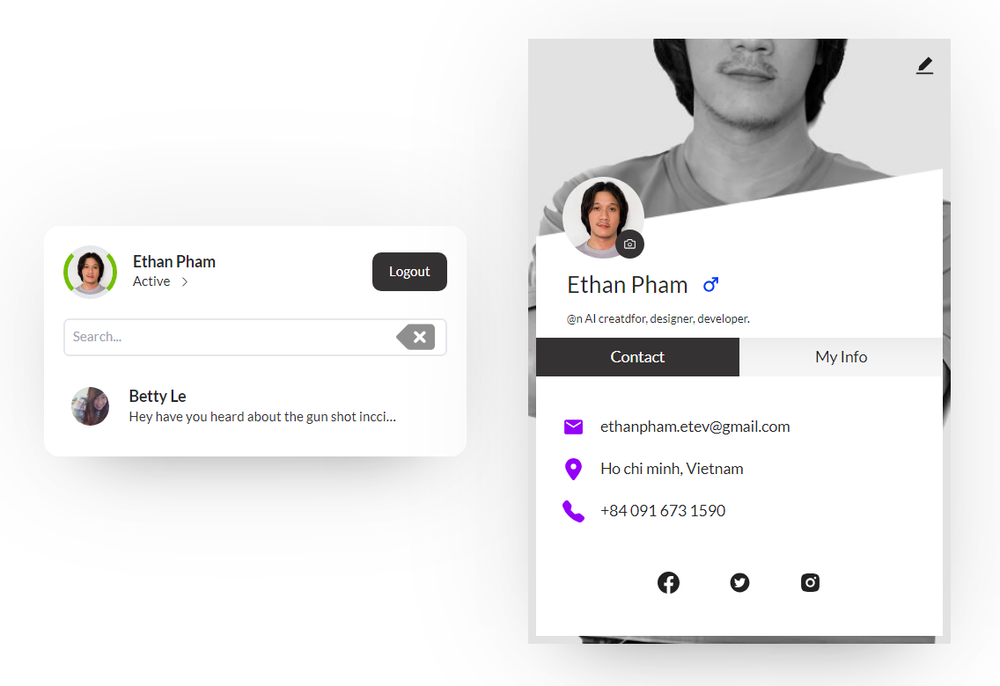

# Chat App with React (Vite) + Firebase + Tailwind

## Overview

> This project provides FE & BE source code for Fire Chatter Project base on React 18

## Crossbrowsers support

> The browser version must at least match the below chart or above for the `animation` & `fallback` to work properly

|         |     |
| ------- | --: |
| Chrome  |  20 |
| Firefox |  28 |
| Safari  | 6.1 |
| Edge    |  12 |
| IE      |  11 |
| Opera   |  12 |

## Packages & Dependencies

This project was used with:

|                                                      |        |
| ---------------------------------------------------- | ------ |
| [VITE](https://github.com/vitejs/vite)               | 4.4.9  |
| [Node](https://nodejs.org/)                          | 16.3.0 |
| [Package Manager](https://www.npmjs.com/package/npm) | 7.18.1 |

## Run development server

### Auto reload

1. Run `yarn dev`
2. Navigate to [5173](http://localhost:5173/)

> Automatically reload if you change any of the source files.

## Environments & configuration

- Development: src/.env

## Build

With specific environment, you can run build process with `yarn build`

## Linting

Run `yarn lint` before pushing to repository. Remember, **fix all highlight** before pushing, thank you!

> Add this comment on top of the next line you want ignore eslint just in case
> `// eslint-disable-next-line <lint>`

for further reference, check .eslintrc.json
